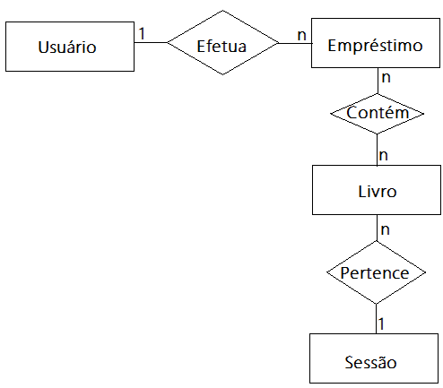

# Api RestFull biblioteca
O foco desta aplicação é apenas para estudo das tecnoligias utilizadas.
Para esta aplicação foram utilizadas as seguintes tecnologias:
1. [NodesJS](https://nodejs.org/en/) - Framework que permite realizar as mágicas(técnicas) de programação com JavaScript.
2. [ExpressJS](https://expressjs.com/) - Framework que fará as rotas da api e disponibilizará via metodos HTTP.
3. [SequelizeJS](https://sequelize.org) - ORM que fará toda persisteência da base de dados.
4. [MySQL](https://www.mysql.com/) - A base de dados que armazenará as informações.

A aplicação é baseada num modelo de entidade e relacionamento bem simples, a seguir:


# Instruções
Para fazer a aplicação funcionar utilizando uma base de dados MySQL, deve-se setar a variavel de ambiente `DB_IP_HOST` na sessão do terminal que irá rodar a aplicação com IP ou HOSTNAME com onde contem um MySQL Server.
## Para Windows
```cmd
set DB_IP_HOST=IP_HOSTNAME
```
## Para Linux ou Mac
```shell
export DB_IP_HOST=IP_HOSTNAME
```
Após o MySQL Server pronto para uso e a variável ```DB_IP_HOST``` configurada, na raiz do projeto, na mesma sessão de terminal que foi configurada a variável, executar os seguintes comandos:

Este comando irá instalar as dependências necessárias
```cmd
npm install
```
Este comando irá criar a base de dados, sem as tabelas ou quaisquer outros objetos.
```cmd
npx sequelize db:create
```
Criará as tabelas com os campos necessários, e relacionamentos.
```cmd
npx sequelize db:migrate
```
Irá popular as tabelas com os dados iniciais.
```cmd
npx sequelize db:seed:all
```